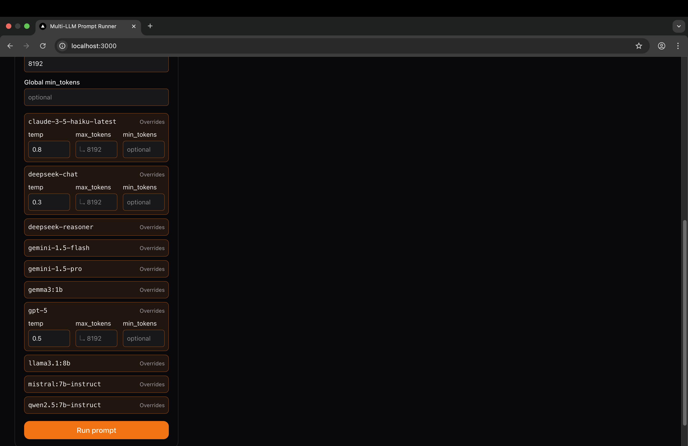
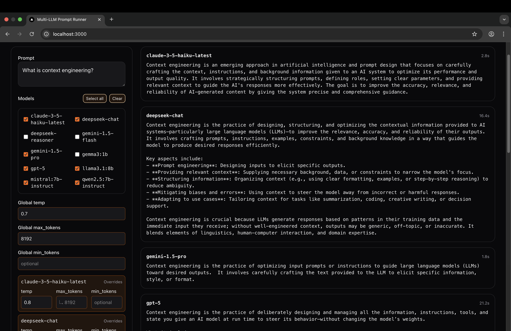
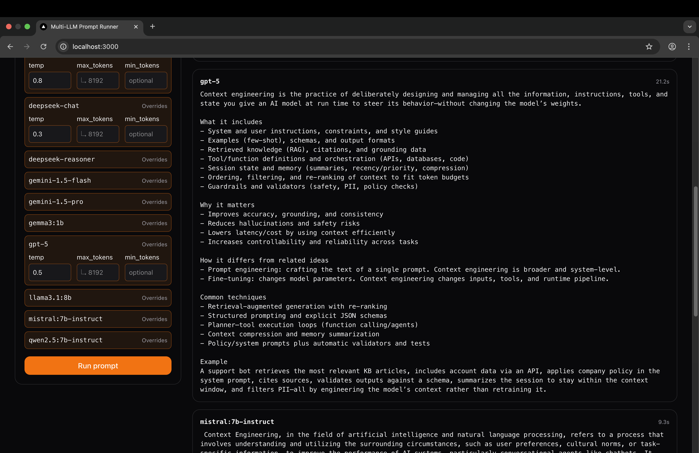
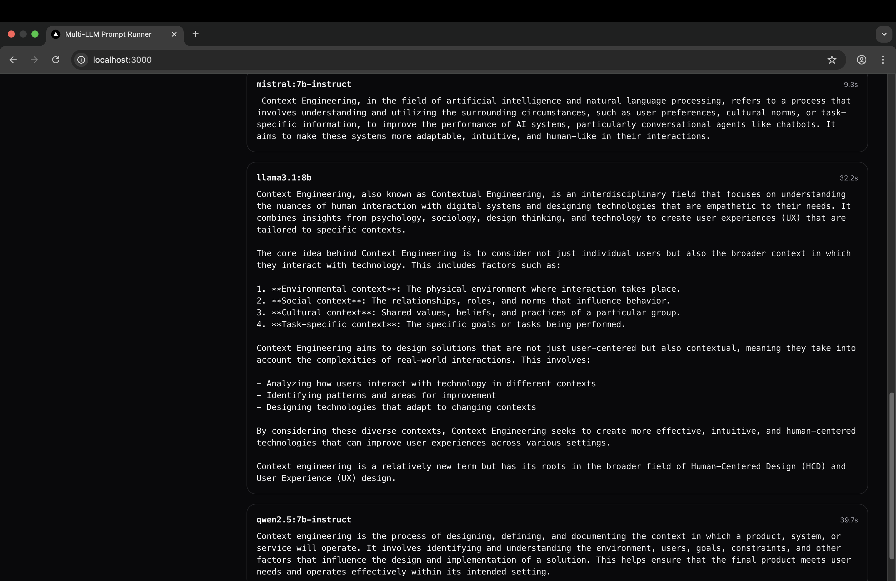
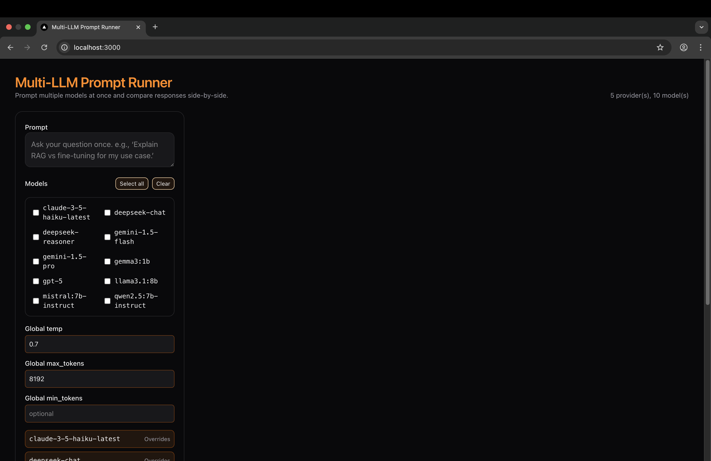

# 🎤 AskManyLLMs

*A multimodal prompting tool for exploring and comparing LLMs*

AskManyLLMs is a **multimodal prompting playground** where you can send the same text or image prompt to multiple models (OpenAI, Anthropic, Gemini, Ollama, vLLM, etc.) and watch their responses stream back in real time.

Perfect for **experimentation, RAG prototyping, or just seeing how different models think side by side**.

---

## 🚀 Features

* **Multi-Provider Support**: OpenAI, Anthropic, Gemini, DeepSeek, Ollama, vLLM, and more.
* **Multimodal Ready**: Send text, images, or structured prompts.
* **Streaming Responses**: Real-time NDJSON streaming.
* **Frontend Playground**: Next.js + Tailwind, clean and responsive.
* **Configurable**: Easily add/remove models via `models.yaml`.
* **Dockerized Setup**: Run everything locally in one command.

---

## 🖼 Demo

Here’s a quick look at AskManyLLMs in action:

### Home screen


### Model controls & overrides


### Sending prompts (text + multimodal)



### Loading state


### Results streaming back




### Image input example


---

## ⚡ Quick Start

### 1. Clone the repo

```bash
git clone https://github.com/DimitarAtanassov/askManyLLMs.git
cd AskManyLLMs
```

### 2. Set up environment variables

Copy the example file and update it with your own API keys:

```bash
cp .env.example .env
```

Edit `.env` and fill in your keys:

* `OPENAI_API_KEY` → [Get here](https://platform.openai.com/)
* `DEEPSEEK_API_KEY` → [Get here](https://platform.deepseek.com/)
* `GOOGLE_API_KEY` (Gemini) → [Get here](https://aistudio.google.com/app/apikey)
* `ANTHROPIC_API_KEY` → [Get here](https://console.anthropic.com/)

Ollama requires **no API key** — just ensure it’s installed and running locally.

### 3. Start with Docker

```bash
docker compose up --build
```

This will start:

* FastAPI backend (NDJSON streaming API)
* Next.js frontend (interactive UI)
* Any configured Ollama/vLLM containers

### 4. Visit the playground

Frontend will be available at:
👉 [http://localhost:3000](http://localhost:3000)

---

## 🛠 Tech Stack

* **Backend**: FastAPI + Python
* **Frontend**: Next.js + TailwindCSS
* **Infra**: Docker Compose
* **Streaming**: NDJSON over HTTP

---

## 🎯 Why?

Prompting across models should be **easy, fun, and visual**.
AskManyLLMs makes it possible to experiment with **multimodal prompts** and see how models respond differently — side by side.

---
