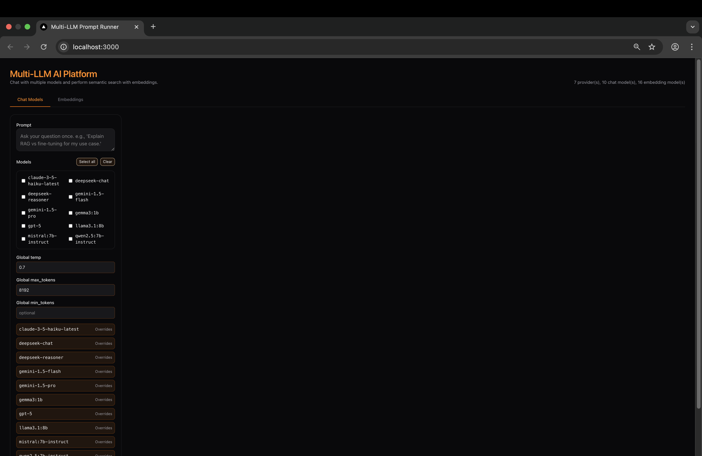
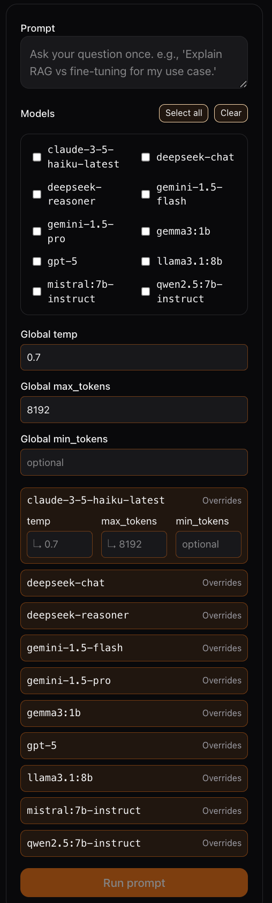
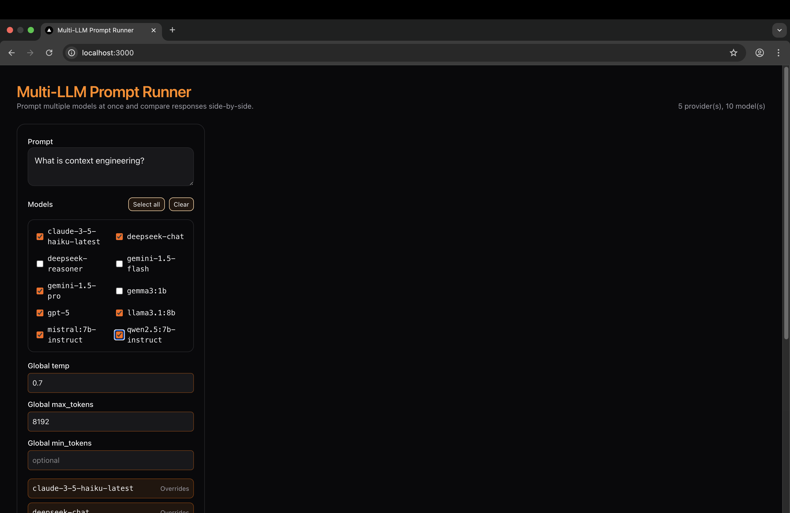
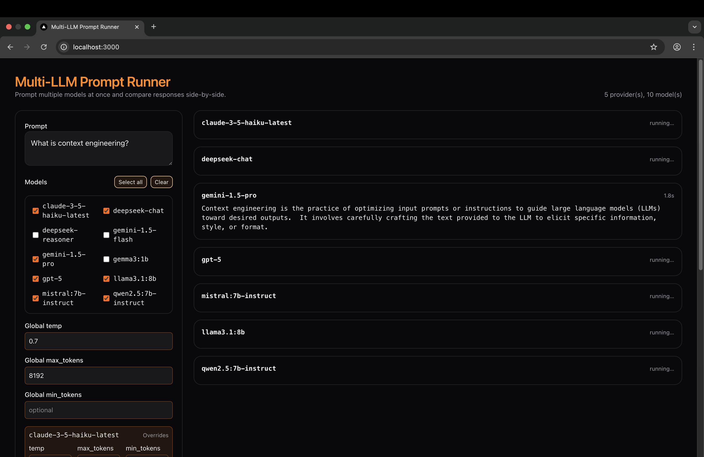
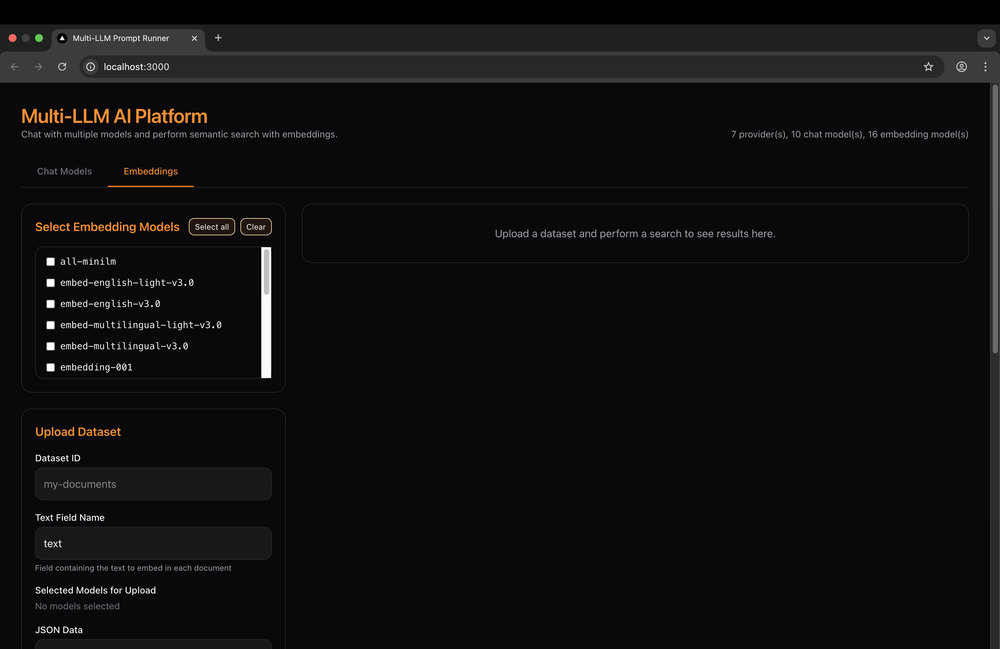
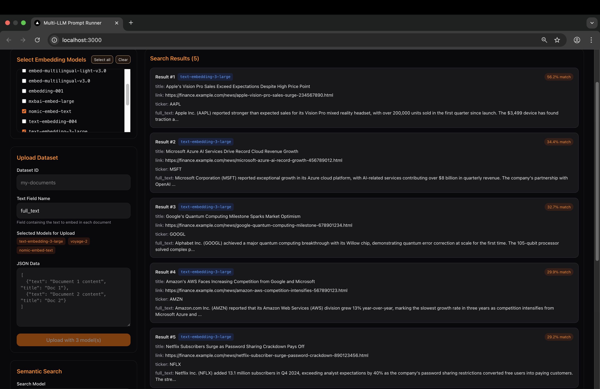

# LLMCompare
A comprehensive multi-LLM platform for comparing, chatting, and searching across multiple AI models and providers.

LLMCompare is a powerful playground where you can:
- **Multi-Model Chat**: Send prompts to multiple models simultaneously (OpenAI, Anthropic, Gemini, Ollama, DeepSeek, etc.) and compare responses in real-time
- **Interactive Conversations**: Click on any model response to enter a dedicated chat mode with full conversation history
- **Semantic Search**: Upload documents, generate embeddings across multiple providers, and perform cosine similarity search
- **OpenAI-Compatible API**: Use standard OpenAI chat completion format with any supported model
- **Flexible Configuration**: Easy YAML-based model configuration with per-model parameter overrides

---

## 🚀 Key Features

### 🤖 **Multi-Provider Chat Support**
- **Providers**: OpenAI, Anthropic Claude, Google Gemini, DeepSeek, Ollama (local), and more
- **Streaming Responses**: Real-time NDJSON streaming for immediate feedback
- **Side-by-Side Comparison**: Run the same prompt across multiple models simultaneously
- **Interactive Chat**: Click any response to continue chatting with that specific model
- **Conversation History**: Full context retention across chat sessions

### 🔍 **Advanced Embedding & Search**
- **Multi-Provider Embeddings**: OpenAI, Voyage AI, Cohere, Ollama (local embeddings)
- **Document Upload**: JSON-based dataset management with automatic embedding generation
- **Semantic Search**: Cosine similarity search across your documents
- **Multiple Embedding Models**: Compare embedding quality across different providers

### ⚙️ **Developer-Friendly API**
- **OpenAI-Compatible Endpoints**: Drop-in replacement for OpenAI API (`/v1/chat/completions`)
- **Multi-Model Extension**: Custom endpoint for querying multiple models at once
- **Legacy Support**: Backward-compatible endpoints for existing integrations
- **Comprehensive Logging**: Structured JSON logging for monitoring and debugging

### 🎛️ **Advanced Configuration**
- **Per-Model Parameters**: Individual temperature, max_tokens, min_tokens settings
- **Global Defaults**: Set base parameters with model-specific overrides
- **Dynamic Model Registry**: Add/remove models via YAML configuration
- **Environment-Based Secrets**: Secure API key management

---

## 🏗️ Architecture

### Backend (FastAPI + Python)
```
├── API Layers
│   ├── /v1/chat/completions (OpenAI-compatible)
│   ├── /v1/chat/completions/multi (Multi-model extension)
│   └── /legacy/* (Backward compatibility)
├── Services
│   ├── ChatService (Multi-model chat orchestration)
│   ├── EmbeddingService (Multi-provider embeddings)
│   ├── DatasetService (Document management)
│   └── SearchService (Semantic search)
├── Adapters
│   ├── ChatAdapter (Provider-specific chat implementations)
│   └── EmbeddingAdapter (Provider-specific embedding implementations)
└── Storage
    └── MemoryStorageBackend (In-memory dataset storage)
```

### Frontend (Next.js + TailwindCSS)
- **Responsive Design**: Works on desktop and mobile
- **Real-Time Streaming**: Live response updates
- **Interactive Chat**: Modal-based conversations with individual models
- **Tabbed Interface**: Separate sections for chat and embeddings
- **Parameter Controls**: Fine-tune model behavior per request

---

## 🖼️ Demo

### Multi-Model Chat Comparison

*Compare responses from multiple AI models side-by-side*


*Fine-tune parameters for each model individually*

### Interactive Chat Sessions

*Click any response to start an interactive conversation*


*Real-time streaming responses*

### Semantic Search & Embeddings

*Upload documents and generate embeddings*


*Find similar documents using cosine similarity*

---

## ⚡ Quick Start

### 1. Clone and Setup

```bash
git clone https://github.com/DimitarAtanassov/LLMCompare.git
cd LLMCompare
```

### 2. Configure Environment

Copy and edit the environment file:

```bash
cp .env.example .env
```

**Required API Keys:**
```bash
# OpenAI (Chat + Embeddings)
OPENAI_API_KEY=sk-proj-your-key-here

# DeepSeek (Chat)
DEEPSEEK_API_KEY=sk-your-key-here

# Google Gemini (Chat)
GOOGLE_API_KEY=AIza-your-key-here

# Anthropic Claude (Chat)
ANTHROPIC_API_KEY=sk-ant-your-key-here

# Voyage AI (Premium Embeddings)
VOYAGE_API_KEY=pa-your-key-here

# Cohere (Chat + Embeddings)
COHERE_API_KEY=your-key-here
```

### 3. Configure Models

Edit `config/models.yaml` to add/remove models:

```yaml
providers:
  openai:
    type: openai
    base_url: https://api.openai.com/v1
    api_key_env: OPENAI_API_KEY
    models:
      - gpt-4o          # Latest GPT-4
      - gpt-4           # Standard GPT-4
      - gpt-3.5-turbo   # Fast and efficient
    embedding_models:
      - text-embedding-3-large
      - text-embedding-ada-002

  anthropic:
    type: anthropic
    base_url: https://api.anthropic.com
    api_key_env: ANTHROPIC_API_KEY
    models:
      - claude-3-5-sonnet-20241022
      - claude-3-haiku-20240307

  ollama:
    type: ollama
    base_url: http://ollama:11434
    models:
      - llama3.1:8b
      - qwen2.5:7b-instruct
      - mistral:7b-instruct
    embedding_models:
      - nomic-embed-text
      - all-minilm
```

### 4. Start with Docker

```bash
docker compose up --build
```

**Services Started:**
- 🚀 **Frontend**: [http://localhost:3000](http://localhost:3000)
- 🔧 **API**: [http://localhost:8080](http://localhost:8080)
- 📊 **API Docs**: [http://localhost:8080/docs](http://localhost:8080/docs)
- 🏥 **Health Check**: [http://localhost:8080/health](http://localhost:8080/health)

---

## 🛠️ API Usage

### OpenAI-Compatible Chat

```python
import openai

# Point to your local instance
client = openai.OpenAI(
    base_url="http://localhost:8080/v1",
    api_key="not-needed-for-local"
)

# Use any configured model
response = client.chat.completions.create(
    model="gpt-4o",  # or any model from your config
    messages=[
        {"role": "user", "content": "Explain quantum computing"}
    ]
)
```

### Multi-Model Comparison

```python
import requests

response = requests.post("http://localhost:8080/v1/chat/completions/multi", json={
    "models": ["gpt-4o", "claude-3-5-sonnet-20241022", "llama3.1:8b"],
    "messages": [
        {"role": "user", "content": "What is the future of AI?"}
    ],
    "temperature": 0.7
})

# Get responses from all models
for choice in response.json()["choices"]:
    print(f"{choice['model']}: {choice['message']['content']}")
```

### Semantic Search

```python
# Upload documents
requests.post("http://localhost:8080/upload-dataset", json={
    "dataset_id": "my-docs",
    "embedding_model": "text-embedding-3-large",
    "documents": [
        {"text": "Python is a programming language", "title": "Python Intro"},
        {"text": "JavaScript runs in browsers", "title": "JS Basics"}
    ]
})

# Search
response = requests.post("http://localhost:8080/search", json={
    "query": "programming languages",
    "dataset_id": "my-docs_text-embedding-3-large",
    "embedding_model": "text-embedding-3-large"
})
```

---

## 🎯 Use Cases

### 🔬 **Model Research & Comparison**
- Compare response quality across different models
- Test prompt engineering techniques
- Evaluate model performance for specific domains

### 💬 **Interactive AI Conversations**
- Start with side-by-side comparison
- Deep-dive into conversations with best-performing models
- Maintain context across long chat sessions

### 📚 **Knowledge Base Search**
- Upload company documents, research papers, or FAQs
- Generate embeddings with multiple providers
- Perform semantic search to find relevant information

### 🔧 **API Integration Testing**
- Test OpenAI-compatible integrations with different models
- Prototype multi-model applications
- Compare embedding quality across providers

---

## 🛠️ Tech Stack

- **Backend**: FastAPI, Python, Pydantic, httpx
- **Frontend**: Next.js 15, React, TailwindCSS, TypeScript
- **Infrastructure**: Docker Compose, Ollama (local models)
- **APIs**: OpenAI, Anthropic, Google Gemini, DeepSeek, Voyage AI, Cohere

---

## 🎭 Why LLMCompare?

In the rapidly evolving AI landscape, choosing the right model for your use case shouldn't be guesswork. LLMCompare provides:

- **Instant Comparison**: See how different models handle the same prompt
- **Cost Optimization**: Compare expensive vs. efficient models for your needs
- **Quality Assessment**: Evaluate response quality across providers
- **Seamless Integration**: OpenAI-compatible API for easy adoption
- **Local & Cloud**: Mix local (Ollama) and cloud models as needed

Perfect for researchers, developers, and AI enthusiasts who want to make informed decisions about model selection and understand the nuances between different AI providers.

---