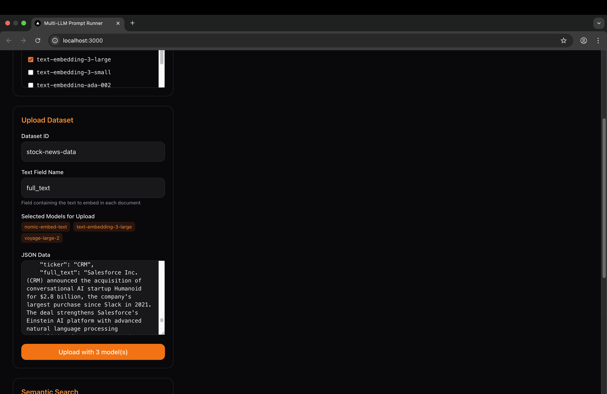
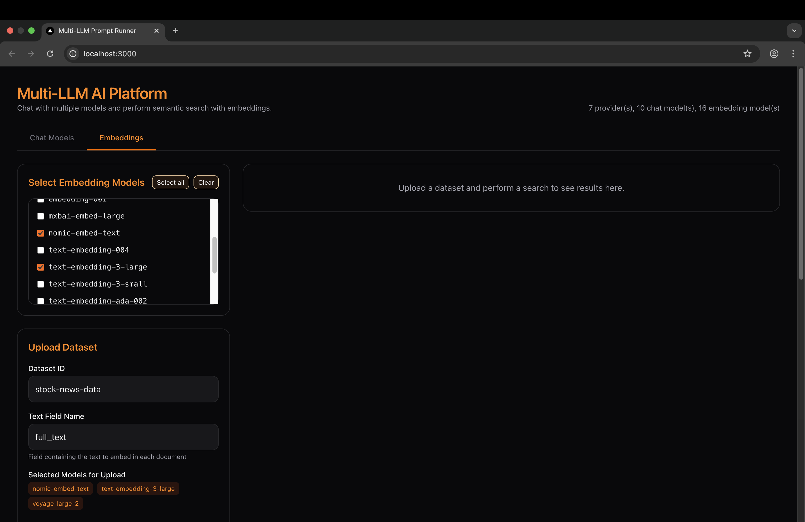
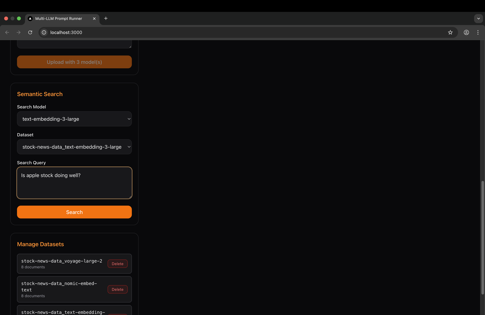
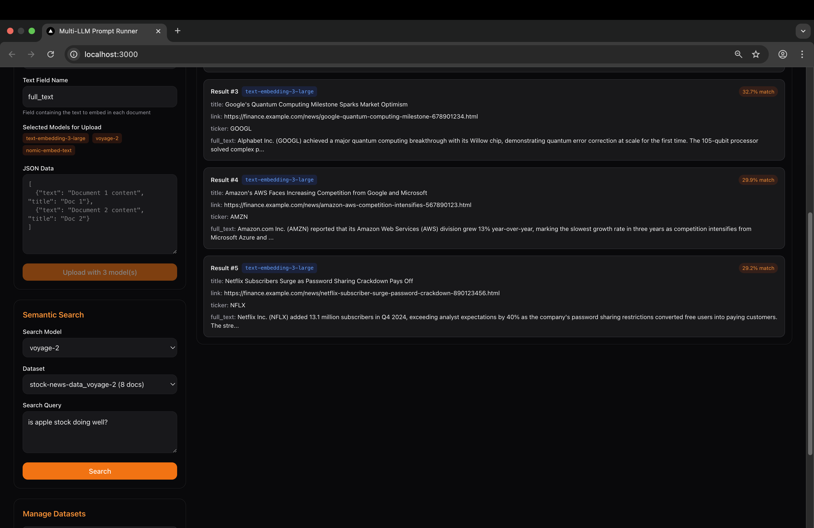
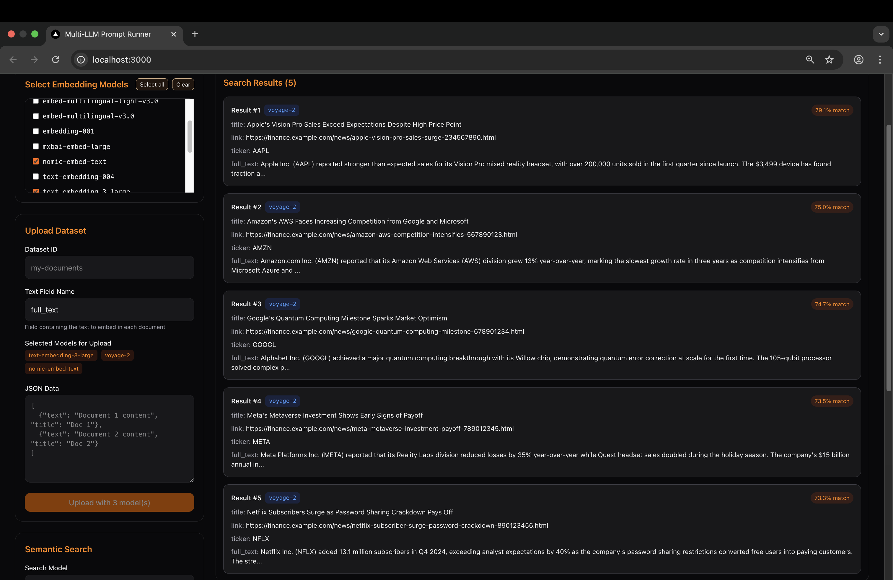
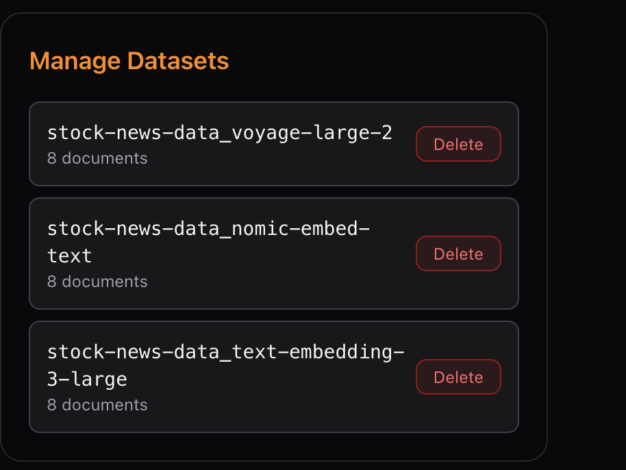

# LLMCompare
A prompting and embedding tool for exploring and comparing LLMs.

AskManyLLMs is a playground where you can:
- Send the same text prompt to multiple models (OpenAI, Anthropic, Gemini, Ollama, vLLM, etc.) and watch their responses stream back in real time.  
- Generate **embeddings** across multiple providers (OpenAI, Voyage AI, Cohere, Ollama, etc.) from the same input, making it easy to run side-by-side
---

## 🚀 Features

* **Multi-Provider Support**: OpenAI, Anthropic, Gemini, DeepSeek, Ollama, vLLM, and more.
* **Embeddings Support**: End users can now generate embeddings from multiple providers (OpenAI, Voyage AI, open-source backends, etc.) in parallel for the same input, enabling side-by-side comparison and cosine similarity search.
* **Streaming Responses**: Real-time NDJSON streaming.
* **Frontend Playground**: Next.js + Tailwind, clean and responsive.
* **Configurable**: Easily add/remove models via `models.yaml`.
* **Dockerized Setup**: Run everything locally in one command.

---

## 🖼 Demo

Here’s a quick look at AskManyLLMs in action:
### Prompt Testing:
#### Home screen


#### Model controls & overrides


#### Sending prompts (text + multimodal)


#### Loading state


#### Results streaming back


### Semantic Search testing (embeddings + cosine similarity search)
#### Embedding Home

#### Load Embedding Data

#### Select Embedding Models

#### Semantic Search Input

#### Semantic Search Results

#### Semantic Search Input 2

#### Semantic Search Results 2

#### Manage Loaded Data

---

## ⚡ Quick Start

### 1. Clone the repo

```bash
git clone https://github.com/DimitarAtanassov/askManyLLMs.git
cd AskManyLLMs
```

### 2. Set up environment variables

Copy the example file and update it with your own API keys:

```bash
# ======================
# Core API Config
# ======================
MODELS_CONFIG=/config/models.yaml
LOG_LEVEL=INFO

# ======================
# OpenAI (Chat + Embeddings)
# ======================
# Replace with your OpenAI API key (format: sk-proj-...)
OPENAI_API_KEY=

# ======================
# DeepSeek (Chat)
# ======================
# Replace with your DeepSeek API key (format: sk-...)
DEEPSEEK_API_KEY=

# ======================
# Google Gemini (Chat)
# ======================
# Replace with your Google API key (format: AIza...)
GOOGLE_API_KEY=

# ======================
# Anthropic Claude (Chat)
# ======================
# Replace with your Anthropic API key (format: sk-ant-...)
ANTHROPIC_API_KEY=

# ======================
# Voyage AI (Embeddings - Premium)
# ======================
# Replace with your Voyage AI key (format: pa-...)
VOYAGE_API_KEY=

# ======================
# Cohere (Chat + Embeddings)
# ======================
# Replace with your Cohere API key if available
COHERE_API_KEY=

# ======================
# Ollama (Local Models - Chat + Embeddings)
# ======================
# No API key needed for local models, just ensure Ollama is running
# Example: ollama serve (inside container or host)

```

Edit `.env` and fill in your keys:

* `OPENAI_API_KEY` → [Get here](https://platform.openai.com/)
* `DEEPSEEK_API_KEY` → [Get here](https://platform.deepseek.com/)
* `GOOGLE_API_KEY` (Gemini) → [Get here](https://aistudio.google.com/app/apikey)
* `ANTHROPIC_API_KEY` → [Get here](https://console.anthropic.com/)

Ollama requires **no API key** — just ensure it’s installed and running locally.

### 3. Start with Docker

```bash
docker compose up --build
```

This will start:

* FastAPI backend (NDJSON streaming API)
* Next.js frontend (interactive UI)
* Any configured Ollama/vLLM containers

### 4. Visit the playground

Frontend will be available at:
👉 [http://localhost:3000](http://localhost:3000)

---

## 🛠 Tech Stack

* **Backend**: FastAPI + Python
* **Frontend**: Next.js + TailwindCSS
* **Infra**: Docker Compose
* **Streaming**: NDJSON over HTTP

---

## 🎯 Why?

Prompting across models should be easy, fun, and visual. AskManyLLMs makes it possible to experiment with text prompts and see how models respond differently — side by side.

---
