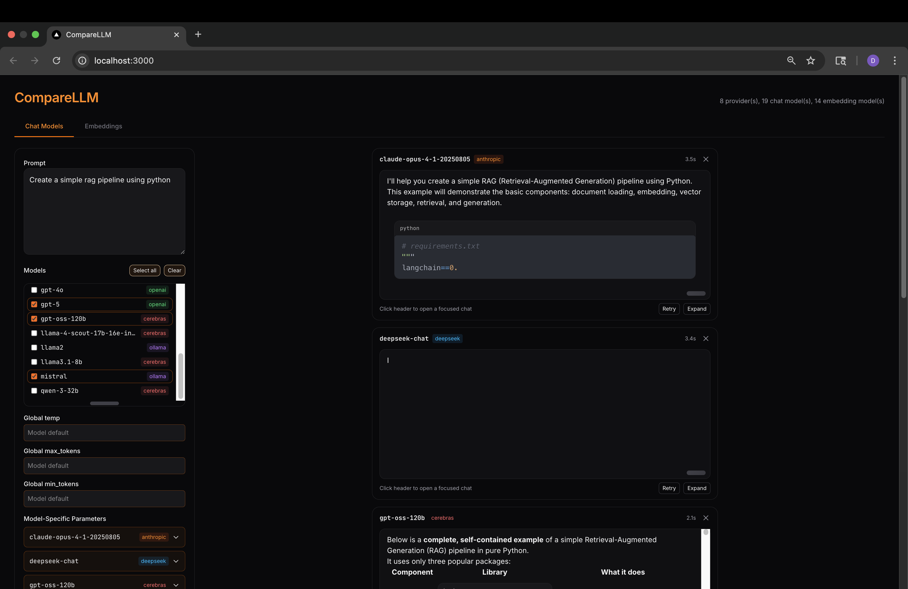
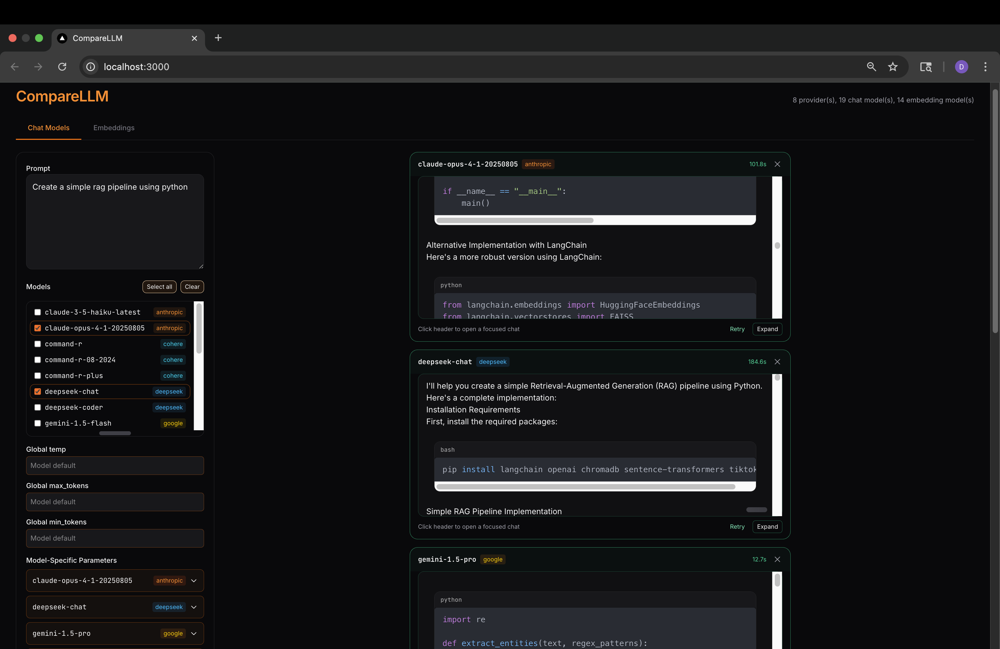
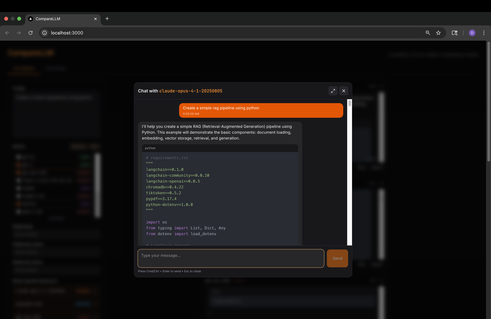
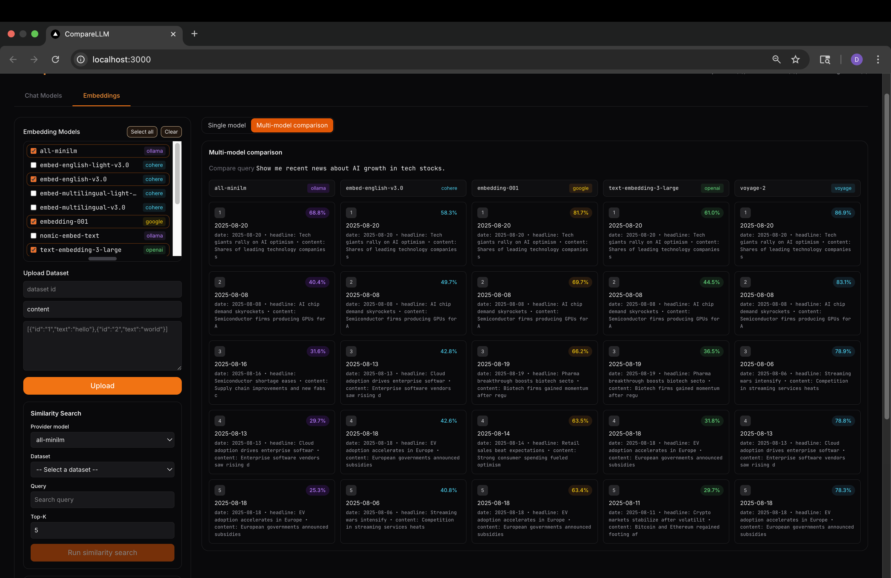
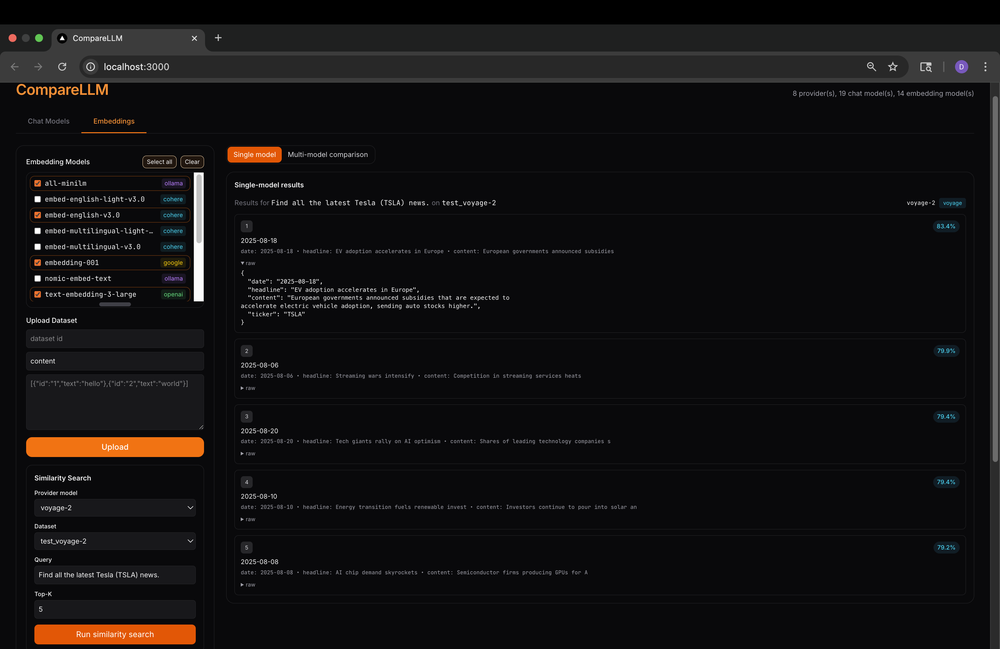

# CompareLLM

A multi-provider AI playground for running, comparing, and embedding across many
LLMs in real time.

- Frontend: Next.js / React / Tailwind
- Backend: FastAPI (Python 3.11+), native provider SDKs (no LangChain / LangGraph)
- Persistence: PostgreSQL + pgvector (embeddings), Redis (chat session memory)
- Infrastructure: Docker Compose

Supported providers: Anthropic, OpenAI, DeepSeek, Google Gemini, Ollama (local),
Cerebras, Cohere, and Voyage.

---

## Features

- Multi-model chat comparison: send one prompt to many models in parallel with
  true token streaming over Server-Sent Events (SSE).
- Interactive single-model chat that shares per-thread memory with the compare view.
- Embeddings and semantic search: upload a dataset, index it with one or more
  embedding models, and run single-model search or side-by-side multi-model compare.
- Unified, normalized generation parameters (temperature, max tokens, top-p/top-k,
  penalties, stop sequences, reasoning budget) mapped per provider in one place.

---

## Architecture

The backend is a layered, provider-agnostic service. Each layer depends only on
the layer beneath it, which keeps the system orthogonal and easy to evolve.

```
backend/app/
  settings.py            Typed configuration (pydantic-settings)
  logging.py             Structured JSON logging (structlog)
  errors.py              Error hierarchy + problem+json handlers
  sse.py                 Server-Sent Events encoder
  config/                models.yaml schema + validated loader
  domain/
    models.py            ChatMessage, GenerationParams, SearchHit
    chat_service.py      Concurrent multi-model streaming + memory
    embedding_service.py Indexing, search, and cross-model compare
  providers/
    base.py              ChatProvider / EmbeddingProvider protocols
    params.py            Single source of truth for parameter normalization
    registry.py          Resolves provider:model targets to adapters
    openai_compat.py     OpenAI / DeepSeek / Cerebras / Ollama
    anthropic_provider.py
    gemini_provider.py
    cohere_provider.py
    voyage_provider.py
  infra/
    vectorstore/         VectorStore protocol; memory + pgvector backends
    session/             SessionStore protocol; memory + redis backends
  api/
    container.py         Composition root (wires everything together)
    deps.py              Typed FastAPI dependencies
    middleware.py        Request IDs + access logging
    routers/             health, providers, chat, embeddings
  main.py                Application factory and entrypoint
```

### Design principles

- One provider abstraction. Adapters speak directly to each provider SDK and yield
  plain text deltas, so no provider-specific chunk shapes leak into the rest of the
  system.
- One streaming contract. A single SSE endpoint serves both multi-model compare and
  single-model interactive chat.
- Pluggable persistence. Vector and session storage are chosen by configuration
  (`VECTOR_BACKEND`, `SESSION_BACKEND`) and default to in-memory for zero-dependency
  local runs; production uses pgvector and Redis.
- Explicit composition. All services are wired in one composition root and injected
  via typed dependencies.

---

## Configuration

Providers and models are declared in `config/models.yaml`. Each provider entry is
validated at startup:

```yaml
providers:
  openai:
    type: openai
    base_url: https://api.openai.com/v1
    api_key_env: OPENAI_API_KEY
    models:
      - gpt-4o
    embedding_models:
      - text-embedding-3-large
```

Runtime configuration is read from environment variables (see `.env.example`).

| Variable           | Default                        | Description                              |
| ------------------ | ------------------------------ | ---------------------------------------- |
| `MODELS_CONFIG`    | `/config/models.yaml`          | Path to the provider catalogue           |
| `VECTOR_BACKEND`   | `memory`                       | `memory` or `pgvector`                   |
| `SESSION_BACKEND`  | `memory`                       | `memory` or `redis`                      |
| `DATABASE_URL`     | (unset)                        | Required when `VECTOR_BACKEND=pgvector`  |
| `REDIS_URL`        | (unset)                        | Required when `SESSION_BACKEND=redis`    |
| `CORS_ALLOW_ORIGINS` | `http://localhost:3000,...`  | Comma-separated allowed origins          |
| `LOG_LEVEL`        | `INFO`                         | Log level                                |
| `LOG_JSON`         | `true`                         | JSON logs (`false` for console)          |

Provider API keys are supplied via the env var named in each provider's
`api_key_env`. A provider whose key is missing is logged and simply skipped.

---

## Quick start

### Run with Docker Compose

```bash
cp .env.example .env   # then fill in your provider API keys
docker compose up --build
```

Services started: `postgres`, `redis`, `ollama`, `model-puller`, `api`, `ui`.

Open the UI at http://localhost:3000.

### Run the backend locally

The backend is managed with [uv](https://docs.astral.sh/uv/).

```bash
cd backend
uv sync   # create the locked .venv and install all dependencies

export MODELS_CONFIG=../config/models.yaml
# Defaults to in-memory backends; no Postgres/Redis required.
uv run uvicorn app.main:app --reload --port 8080
```

---

## API overview

### Health

```
GET /health      Liveness
GET /readyz       Readiness (config loaded, models available)
```

### Providers

```
GET  /providers           List providers and their chat/embedding models
GET  /providers/{key}     One provider
POST /providers/reload    Reload models.yaml
```

### Chat (unified streaming)

```
POST /chat/stream
Accept: text/event-stream
{
  "targets": ["openai:gpt-4o", "anthropic:claude-opus-4-1-20250805"],
  "messages": [{ "role": "user", "content": "Write a haiku about oceans." }],
  "per_model_params": {
    "openai:gpt-4o": { "temperature": 0.7, "top_p": 0.95 }
  },
  "thread_id": "thread:abc123"
}
```

The response is an SSE stream of named events:

| Event   | Payload              | Meaning                          |
| ------- | -------------------- | -------------------------------- |
| `start` | `{ model }`          | A model began streaming          |
| `delta` | `{ model, text }`    | A token delta for a model        |
| `error` | `{ model, error }`   | A model failed (others continue) |
| `end`   | `{ model }`          | A model finished                 |
| `done`  | `{}`                 | All models finished              |

A single target makes this an interactive chat. Reusing the same `thread_id`
continues that conversation: prior turns are prepended and the new turn plus the
response are persisted per `(thread_id, model)`.

### Embeddings

```
GET    /embeddings/models           List embedding models
GET    /embeddings/stores           List vector stores
POST   /embeddings/stores           Create a store { store_id, embedding_key }
DELETE /embeddings/stores/{id}      Delete a store
POST   /embeddings/index/texts      Index raw texts
POST   /embeddings/index/docs       Index { page_content, metadata } documents
POST   /embeddings/query            Search one store (similarity | mmr | threshold)
POST   /embeddings/compare          Search one dataset across multiple models
```

Store ids follow the convention `{dataset_id}::{provider:model}`, which lets the
same dataset be embedded by multiple models and compared side by side.

---

## Development

The backend uses [uv](https://docs.astral.sh/uv/) and a Makefile for all quality gates:

```bash
cd backend
make lintable   # auto-format and auto-fix
make lint       # uv lock --check + ruff format/check + mypy
make test       # pytest with coverage (no network; uses fakes)
```

Continuous integration runs `make lint` and `make test` on every push and pull
request (`.github/workflows/ci.yml`).

---

## Screenshots

1. Prompt input and multi-model comparison
   
2. Model completion results
   
3. Interactive single-model chat
   
4. Side-by-side embedding comparison
   
5. Single-model embedding search
   

---

## License

MIT
