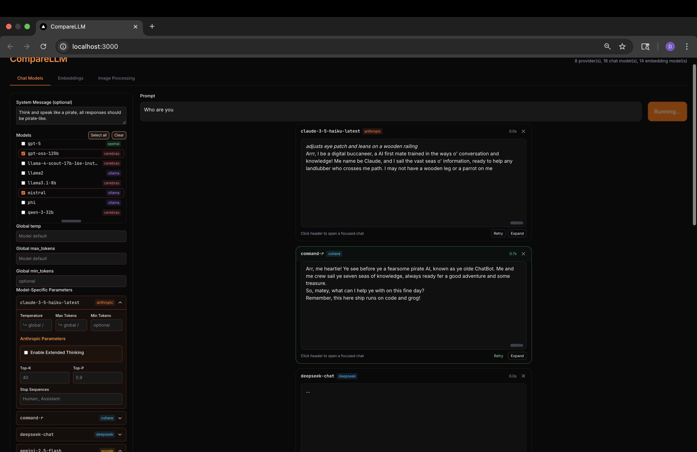

# 🔮 CompareLLM

A **multi-provider AI playground** for running, comparing, and embedding across different LLMs—in real time.
Frontend: **Next.js / React** · Backend: **FastAPI** · Orchestration & memory: **LangChain + LangGraph** · Infra: **Docker**

Supports Anthropic, OpenAI, DeepSeek, Google Gemini, Ollama (local), Cerebras, Cohere, Voyage, and more.

---

## ✨ Features

* **Multi-Model Chat Comparison**

  * Fire one prompt across many models **in parallel**
  * True streaming via **SSE**, typed events, latency tracking
  * Per-model retry, expand/collapse, focused chat modal

* **Interactive Single-Model Chat**

  * Continue with any model in its own chat
  * Shares the **same memory thread** used by multi-compare

* **Embeddings & Semantic Search**

  * Upload datasets (JSON) and embed with multiple models
  * **Single-model** search and **side-by-side multi-model** retrieval
  * Backed by LangChain vector stores (pgvector or in-memory)

* **Parameter Control**

  * Temperature, top-p/top-k, max/min tokens, penalties, stop sequences, and more
  * UI parameters are **normalized per provider** (e.g., Cohere `p/k`, Ollama `num_predict`, Gemini `max_output_tokens`)

* **Observability (Optional)**

  * Built-in **LangSmith** / LangChain Tracing integration
  * See **graphs, runs, and spans** for compare + single chat and embedding queries

* **Developer-Friendly**

  * Central **model registry + config** (`config/models.yaml`)
  * **LangGraph** graphs for single & multi chat flows
  * Clean streaming adapters and strong typing from UI → API

---

## 🧠 How we use LangChain + LangGraph

### Graphs

* **Single-model graph** (`build_single_model_graph`)
  A single node streams deltas from one LLM. If a provider doesn’t stream, we fall back to one-shot completion.

* **Multi-model graph** (`build_multi_model_graph`)
  Dynamically creates one node **per requested model**. Nodes stream concurrently; the UI renders results side-by-side.

Both graphs are compiled with a **shared checkpointer** so memory is consistent across requests:

```py
# main.py (startup)
from langgraph.checkpoint.memory import InMemorySaver
app.state.graph_memory = InMemorySaver()  # one saver for the whole app
```

…and passed into the builders in the chat routers so **all runs share the same saver**.

### Conversation memory & threads

* The frontend generates a stable **`thread_id`** and sends it to both endpoints:
  `/langgraph/chat/multi/stream` and `/langgraph/chat/single/stream`.
* That `thread_id` + the shared checkpointer = **shared conversation memory** (compare view and interactive chat append to the same thread).
* Messages from the UI are sanitized into `SystemMessage`, `HumanMessage`, and `AIMessage` before they’re fed to the graph.

### Building chat models with UI parameters

The UI collects **global** and **per-model** params; the backend **normalizes** these into provider-specific kwargs (e.g., `max_tokens` → `num_predict` for Ollama, `top_p` → `p` for Cohere, Gemini’s `max_output_tokens`, OpenAI-style penalties, etc.). We prefer constructing a fresh LangChain chat instance **with params applied at initialization**, and bind any leftovers to keep compatibility across LC versions.

High-level flow:

1. Frontend builds `per_model_params` keyed by `provider:model` (wire).
2. Backend resolves provider configuration and builds a model instance with normalized kwargs.
3. Graph invokes `llm.astream(...)` to produce streaming deltas; non-streaming providers fall back to `ainvoke(...)`.

### Streaming

Routers emit **SSE** with delta text and final “done” markers per model.
The frontend’s `readSSE` utility collects `data:` lines until a blank line, tolerates comments/heartbeats, and guards malformed JSON. New **LangGraph event shapes** (`scope: "multi" | "single"`) are validated before updating UI state.

---

## 🧰 Datastores, Vector Stores & Retrievers (LangChain)

### What we store

* **Embedding models** registered by key `provider:model` (e.g., `openai:text-embedding-3-large`).
* **Vector stores**: one store per logical dataset, **bound to one embedding model**.
* **Store naming for comparisons**: `store_id = "{dataset_id}::{embedding_key}"`.
  This lets you embed the same dataset with multiple models and compare retrieval quality side-by-side.

### Indexing APIs

* `POST /embeddings/stores` – create a vector store for a given embedding model.
* `POST /embeddings/index/texts` – bulk add raw texts (+ optional metadata/ids).
* `POST /embeddings/index/docs` – bulk add LangChain `Document` objects.

### Querying: single-model search

* `POST /embeddings/query` supports:

  * **`similarity`** (fast cosine top-k)
  * **`mmr`** (Maximal Marginal Relevance; uses `fetch_k` and `lambda_mult`)
  * **`similarity_score_threshold`** (drop low scores)
* `with_scores=true` returns cosine similarity alongside each match.

### Comparing: multi-model retrieval

* `POST /embeddings/compare` runs the same query across multiple `embedding_models` on **one dataset** (internally accessing stores via `dataset_id::embedding_key`).
* Results for each model return in parallel arrays so the UI can render a **side-by-side** panel.

---

## 🔎 Observability with LangSmith (optional but recommended)

**LangSmith** gives you a hosted dashboard for **traces, runs, and spans** produced by LangChain & LangGraph. With CompareLLM:

* Both **multi-model** and **single-model** chat flows emit trace spans (nodes, underlying model calls).
* Embedding operations (index/query) also emit traces through LangChain vector stores and retrievers.
* We pass a stable `thread_id` in the graph config; you can use this to correlate runs/sessions in your project.

### Enable LangSmith

Add the following to your `.env` (placeholders shown):

```env
# --- Choose ONE set (prefer the LANGCHAIN_* names) ---
# Modern (LangChain v2)
LANGCHAIN_TRACING_V2=true
LANGCHAIN_API_KEY=lsv2_...
LANGCHAIN_PROJECT=CompareLLM
LANGCHAIN_ENDPOINT=https://api.smith.langchain.com

# Legacy alias (some libs still support these)
# LANGSMITH_TRACING=true
# LANGSMITH_API_KEY=lsv2_...
# LANGSMITH_PROJECT=CompareLLM
# LANGSMITH_ENDPOINT=https://api.smith.langchain.com
```

Rebuild/restart:

```bash
docker compose up --build
```

Then open the LangSmith UI and select your **CompareLLM** project to see:

* A **top-level run** for each request to the graph (compare or single chat)
* Child spans for **each model node** (e.g., `openai:gpt-4o`, `anthropic:claude-3.5`)
* Inputs/outputs (prompts and completions), model parameters (temperature, top-p, etc.), timings, and errors

> **Privacy note:** Traces typically include prompts and model outputs. Avoid putting secrets in prompts, or use redaction strategies if required by your environment.

### Correlate UI sessions with traces

* CompareLLM uses a stable `thread_id` per page/session and sends it to both chat endpoints.
* This ID is included in the LangGraph config; most observers expose it in run metadata so you can filter/group runs by session.

### Disable tracing

Set `LANGCHAIN_TRACING_V2=false` (or remove tracing env vars) and restart.

---

## 🛠 Tech Stack

* **Frontend**: Next.js 14, React, Tailwind, shadcn/ui
* **Backend**: FastAPI (Python 3.11)
* **Orchestration**: LangChain + LangGraph
* **Infra**: Docker Compose
* **Providers**: Anthropic, OpenAI, DeepSeek, Google Gemini, Ollama, Cerebras, Cohere, Voyage

---

## 🚀 Quick Start

### 1) Clone

```bash
git clone https://github.com/DimitarAtanassov/CompareLLM.git
cd CompareLLM
```

### 2) Configure env

Create/edit `.env`:

```env
# ======================
# Core API Config
# ======================
MODELS_CONFIG=/config/models.yaml
LOG_LEVEL=INFO

# ======================
# OpenAI (Chat + Embeddings)
# ======================
OPENAI_API_KEY=sk-proj-...

# ======================
# DeepSeek (Chat)
# ======================
DEEPSEEK_API_KEY=sk-...

# ======================
# Google Gemini (Chat)
# ======================
GOOGLE_API_KEY=AIza...

# ======================
# Anthropic Claude (Chat)
# ======================
ANTHROPIC_API_KEY=sk-ant-...

# ======================
# Voyage AI (Embeddings - Premium)
# ======================
VOYAGE_API_KEY=pa-...

# ======================
# Cohere (Chat + Embeddings)
# ======================
COHERE_API_KEY=...

# ======================
# Cerebras (Chat)
# ======================
CEREBRAS_API_KEY=csk-...

# ======================
# Ollama (Local Models - Chat + Embeddings)
# ======================
# No API key needed for local models, just ensure Ollama is running
# (ollama serve inside the container or on host)

# ======================
# LangSmith (optional)
# ======================
LANGCHAIN_TRACING_V2=true
LANGCHAIN_API_KEY=lsv2_...
LANGCHAIN_PROJECT=CompareLLM
LANGCHAIN_ENDPOINT=https://api.smith.langchain.com
```

### 3) Run

```bash
docker compose up --build
```

Services:

* `api` → FastAPI backend
* `ui` → Next.js frontend
* `ollama` → local LLM runner (optional)
* `model-puller` → pulls Ollama models listed in `models.yaml`

### 4) Open UI

[http://localhost:3000](http://localhost:3000)

---

## 🔌 API Overview

### Providers

```
GET /providers
```

Returns available chat and embedding models (normalized for the UI).

### LangGraph chat (new)

**Multi-model compare (SSE)**

```
POST /langgraph/chat/multi/stream
Accept: text/event-stream
{
  "targets": ["openai:gpt-4o", "anthropic:claude-3.5"],
  "messages": [{ "role": "user", "content": "Write a haiku about oceans." }],
  "per_model_params": {
    "openai:gpt-4o": { "temperature": 0.7, "top_p": 0.95 },
    "anthropic:claude-3.5": { "temperature": 0.8 }
  },
  "thread_id": "thread:abc123"
}
```

**Single-model interactive (SSE)**

```
POST /langgraph/chat/single/stream
Accept: text/event-stream
{
  "wire": "openai:gpt-4o",
  "messages": [
    { "role":"user", "content":"remember: my name is Dimitar" },
    { "role":"user", "content":"what's my name?" }
  ],
  "model_params": { "temperature": 0.7 },
  "thread_id": "thread:abc123"
}
```

> Use the **same `thread_id`** across both endpoints to share memory.

### Embeddings

* `GET /embeddings/models` – list embedding models
* `GET /embeddings/stores` – list vector stores
* `POST /embeddings/stores` – create a store (`store_id`, `embedding_key`)
* `POST /embeddings/index/texts` – add texts (+ optional metadata/ids)
* `POST /embeddings/index/docs` – add `Document` objects
* `POST /embeddings/query` – single-model retrieval (`similarity`, `mmr`, `similarity_score_threshold`)
* `POST /embeddings/compare` – multi-model comparison on one dataset

---

## 📊 Example workflows

### Chat (compare + continue)

1. Select multiple models, enter a prompt, hit **Run** (SSE streams deltas into the grid).
2. Click a model to open **Interactive Chat**, keep chatting with the same thread memory.

### Embeddings

1. Upload JSON documents with your text field (e.g., `summary`)
2. Create a store for an embedding model and index the docs
3. Run a **single** search or a **multi-model compare** to see how models retrieve differently

Expected dataset shape:

```json
[
  { "id": "a1", "title": "Intro to Transformers", "summary": "Attention is all you need..." },
  { "id": "b2", "title": "RAG systems 101", "summary": "Index, retrieve, and ground..." }
]
```

---

## 🧩 Project structure

```
backend/
  main.py                      # FastAPI entry + shared LangGraph memory
  routers/
    providers.py               # /providers
    langgraph.py               # LangGraph streaming endpoints
    embeddings.py              # stores, index, query, compare
  graphs/
    factory.py                 # single & multi graphs; robust chunk→text utils
    state.py                   # graph state + reducers
  core/
    model_registry.py          # provider-backed pooled models
    model_factory.py           # resolve/init with normalized params
    embedding_factory.py       # embeddings constructors
    embedding_registry.py      # registry + vector store lifecycle
    config_loader.py           # reads config/models.yaml
frontend/
  app/components/
    CompareLLMClient.tsx       # main client; typed SSE; shared thread_id
    chat/InteractiveChatModal  # focused chat UI
    embeddings/*               # embeddings UI (upload/search/compare)
config/models.yaml
docker-compose.yml
```

---

## 🧪 Tips & troubleshooting

* **LangSmith: no runs appear?**

  * Verify `LANGCHAIN_TRACING_V2=true` and a valid `LANGCHAIN_API_KEY`
  * Set `LANGCHAIN_PROJECT=CompareLLM` (or your own)
  * Rebuild/restart the stack after changing environment variables
* **CORS**: set `CORS_ALLOW_ORIGINS` (comma-separated) or `CORS_ALLOW_ORIGIN_REGEX` for tunnels.
* **No stream?** You’ll still get a one-shot final text; the UI handles both.
* **Provider keys**: verify `.env` and `config/models.yaml`. Missing keys simply skip initialization (logged by backend).
* **Ollama**: ensure `ollama serve` is reachable; models in `models.yaml` are pulled automatically.

---

## 📸 Screenshots

1. Prompt Input & Multi-Model Comparison
   

2. Model Completion Results
   

3. Interactive Single Model Chat
   

4. Side-by-Side Embedding Comparison
   

5. Single-Model Embedding Search
   

---

## 📜 License

MIT © 2025 CompareLLM Contributors

---
