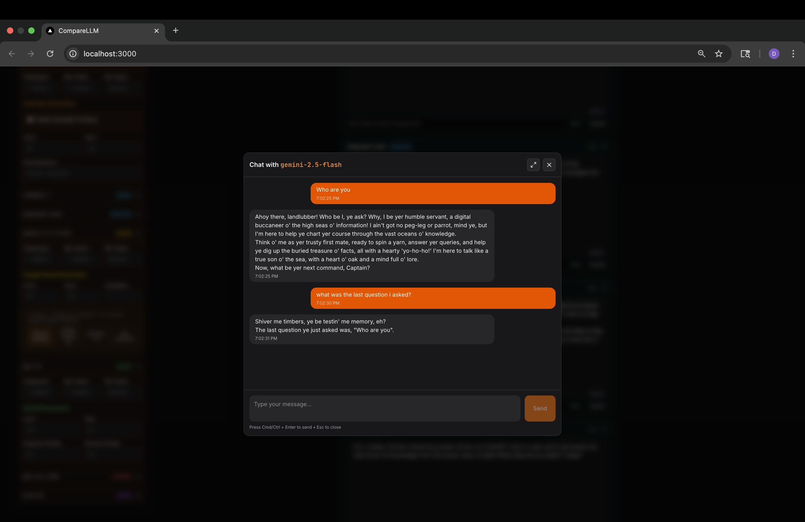

# 🔮 CompareLLM: Multi-Model LLM, Embeddings & Vision Platform

CompareLLM is a production-ready platform for comparing, searching, and interacting with multiple Large Language Models (LLMs), Embedding Models, and Vision Models. It features a modern Next.js UI, a FastAPI backend, and deep integration with LangChain and LangGraph for advanced graph-based workflows.

---

## 🚀 Features

- **Multi-Model Chat**: Compare responses from Anthropic, OpenAI, DeepSeek, Google, Ollama, Cohere, Cerebras, and more.
- **Embeddings Search & Comparison**: Index datasets and run similarity/MMR queries across multiple embedding models side-by-side.
- **Image Processing**: Upload images and run vision models (e.g., Gemini, GPT-4o, Claude) for multimodal tasks.
- **LangGraph Integration**: All chat and embedding flows are powered by LangGraph for flexible, observable, and composable graph-based execution.
- **Observability**: Optional LangSmith integration for tracing, debugging, and monitoring all model and graph runs.
- **Extensible Backend**: Easily add new providers, models, or custom workflows.
- **Dockerized**: One-command deployment with Docker Compose.

---

## 🏗️ Architecture Overview

```
+-------------------+      +-------------------+
|   Next.js UI      | <--> |   FastAPI Backend |
+-------------------+      +-------------------+
         |                        |
         v                        v
+-------------------+      +-------------------+
|  LangChain/Graph  |      |  Model Providers  |
+-------------------+      +-------------------+
         |                        |
         v                        v
+-------------------+      +-------------------+
|   Docker Compose  |      |   Ollama, etc.    |
+-------------------+      +-------------------+
```

- **UI**: Next.js + Tailwind, with tabs for Chat, Embeddings, and Image.
- **Backend**: FastAPI, modular routers for chat, embeddings, vision, providers, and LangGraph-powered flows.
- **LangGraph**: Used for all multi-model and streaming workflows, enabling flexible state management and parallel execution.
- **Config**: All models/providers are defined in `config/models.yaml`.
- **Docker**: Compose file orchestrates Ollama, API, UI, and model-puller services.

---

## 🧠 How LangGraph Works Here

LangGraph is a graph-based orchestration library for LLM workflows. In CompareLLM:

- **Chat Flows**: Each chat request is routed through a LangGraph graph, supporting multi-model streaming and conditional logic.
- **Embeddings**: Embedding queries and comparisons use LangGraph graphs to parallelize retrieval, scoring, and result aggregation.
- **Vision**: Image uploads are processed via LangGraph graphs, enabling multimodal model selection and output streaming.
- **State Management**: All flows use typed state objects (see `backend/graphs/state.py`) for robust, observable execution.
- **Observability**: Each node/run emits trace spans (optionally to LangSmith) for debugging and monitoring.

---

## 🛠️ Technical Details

### Backend
- **FastAPI**: Modular routers for `/chat`, `/embeddings`, `/vision`, `/providers`, `/langgraph`.
- **LangChain & LangGraph**: All model calls, embeddings, and retrievals are wrapped in LangGraph graphs for composability and parallelism.
- **Embeddings**: Supports OpenAI, Cohere, Google, Ollama, Voyage, etc. Each embedding model is registered and managed via `EmbeddingRegistry` and `DatasetCatalog`.
- **Image Processing**: Vision models are exposed via `/vision` endpoints, supporting image uploads and multimodal prompts.
- **Config Loader**: Reads `config/models.yaml` for all provider/model definitions. API keys are loaded from environment variables.
- **Service Layer**: `EmbeddingService` abstracts vector store management, indexing, and querying.

### Frontend
- **Next.js 14+**: Modern React UI with tabs for Chat, Embeddings, and Image.
- **Embeddings UI**: Upload datasets, select models, run single or multi-model searches, view results side-by-side.
- **Image UI**: Upload images, select vision models, view text and image outputs from each model.
- **Chat UI**: Compare chat responses across models, with streaming support.

### Docker & Deployment
- **Ollama**: Local model serving for LLMs and embeddings.
- **API**: FastAPI backend, exposed on port 8080.
- **UI**: Next.js frontend, exposed on port 3000.
- **Model Puller**: Automatically pulls models for Ollama on startup.
- **Config**: All services share config via mounted volumes.

---

## 📦 API Endpoints

### Embeddings
- `POST /embeddings/index/docs` – Bulk add LangChain `Document` objects.
- `POST /embeddings/query` – Query a single embedding model (supports similarity, MMR, score threshold).
- `POST /embeddings/compare` – Run the same query across multiple embedding models, results in parallel arrays for side-by-side UI.

### Chat
- `POST /chat/batch` – Batch chat requests.
- `POST /chat/stream` – Streaming chat responses.

### Vision
- `POST /vision` – Upload image and run selected vision models (multimodal).

### Providers
- `GET /providers` – List all providers and models.
- `GET /providers/vision` – List all vision-capable models.
- `POST /providers/reload` – Reload provider config.

### LangGraph
- `POST /langgraph/chat/single/stream` – Stream chat via LangGraph graph.
- `POST /langgraph/chat/multi/stream` – Stream multi-model chat via LangGraph graph.

---

## ⚙️ Setup & Usage

### 1. Clone & Configure
```sh
git clone https://github.com/your-org/askManyLLMs.git
cd askManyLLMs
cp .env.example .env  # Fill in your API keys
```

### 2. Edit `config/models.yaml`
Define your providers, models, and embedding models. See the provided example for OpenAI, Anthropic, Google, Ollama, Cohere, etc.

### 3. Start with Docker Compose
```sh
docker compose up --build
```
- UI: http://localhost:3000
- API: http://localhost:8080
- Ollama: http://localhost:11434

### 4. Local Development
- **Backend**: `cd backend && uvicorn main:app --reload`
- **Frontend**: `cd ui && npm run dev`

---

## 🔎 Observability with LangSmith (Optional)

LangSmith provides a hosted dashboard for traces, runs, and spans produced by LangChain & LangGraph. To enable:

Add to your `.env`:
```env
LANGSMITH_API_KEY=your-key-here
```
All chat, embedding, and vision flows will emit trace spans for debugging and monitoring.

---

## 🧩 Extending & Customizing

- **Add Providers/Models**: Edit `config/models.yaml` and restart the backend.
- **Custom Graphs**: Extend `backend/graphs/factory.py` to add new LangGraph workflows.
- **UI Customization**: Modify Next.js components in `ui/app/components`.
- **Backend Logic**: Add new routers/services in `backend/routers` and `backend/services`.

---

## 📚 Under the Hood

- **State Management**: TypedDict-based state objects for all flows (see `backend/graphs/state.py`).
- **Registry Pattern**: Embedding and model registries for efficient pooling and lookup.
- **Dataset Catalog**: Tracks datasets and vector stores for embeddings.
- **Streaming & SSE**: All chat and vision endpoints support streaming responses for real-time UI updates.
- **Error Handling**: Robust error handling and logging throughout backend services.

---

## 📝 Contributing

PRs and issues welcome! Please see the code for docstrings and comments. For major changes, open an issue to discuss your proposal.

---

## 📄 License

MIT

---

## 👀 Screenshots

| Chat Completion | Prompt Input | Side-by-Side Embeddings |
|---|---|---|
|  |  |  |

| Single Embed Search | Single Model Interaction |
|---|---|
|  |  |

---

## 💡 Credits

Built with LangChain, LangGraph, FastAPI, Next.js, Tailwind, and Ollama.
